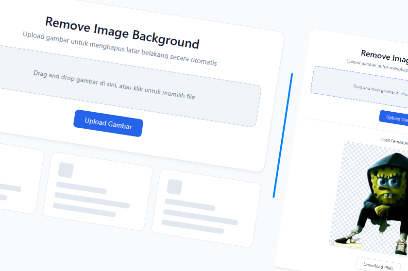

# Remove Background Local Using API Remove BG



## Setup
1. Install Python 3.10+.
2. Create a virtual environment:
   ```bash
   python -m venv venv
   .\\venv\\Scripts\\activate
   ```
3. Install dependencies:
   ```bash
   pip install -r requirements.txt
   ```

## Run
- **Web UI**: `python app.py --serve` and open http://127.0.0.1:5000
- **CLI**: `python app.py --file path/to/image.jpg --out result.png`

Replace the `API_KEY` variable in `app.py` with your own key.
